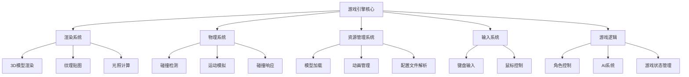

# README

## 项目概述

参照【游戏开发：世嘉新人培训教材】一书，基于C++开发的控制台、2D和3D游戏演示项目，实现了完整的绘图系统、碰撞系统、光照和游戏玩法系统的游戏demo。

<video src="https://github.com/user-attachments/assets/e1e550b9-a3da-44ab-ba46-e47a2ac91fff"/>

### **特点**：

- 原生C++实现，尽可能减少第三方引擎的依赖
- 从XML文件中读取模型配置
- 动画系统数据化
- Lambert光照系统
- 高效的矩阵变换和数学运算库
- 模块化架构设计，易于扩展新游戏状态

[](https://github.com/nekoqqq/MiniGame)
[](https://opensource.org/licenses/MIT)

## 系统简介

### 🚀 核心子系统

- **自定义3D渲染管线**：
  - 易用的绘制系统
  - 支持纹理贴图和UV映射
  - 法线贴图和Lambert光照系统
- **物理引擎**：
  - 三维、四维齐次矩阵线性变换计算库
  - 碰撞检测系统（三角形、球体、立方体）
  - 重力系统
  - 矩形、三角形、球面等几何体碰撞检测
- **资源管理系统**：
  - XML文件读取模块
  - 顶点/索引缓存/模型/纹理资源数据化加载
- **动画系统：**
  - XML文件配置化读取
  - 支持物体变换如缩放、平移、旋转等

### 🎮 游戏功能实现

- **角色控制系统**：
  - 角色移动和跳跃物理
  - 视角旋转控制
  - 导弹发射和跟踪系统
  - 目标自动锁定判定机制
- **AI行为系统**：
  - 敌人随机移动和攻击
- **游戏机制**：
  - 生命值(HP)系统
  - 倒计时和游戏状态管理
  - 小地图实现
- **动画系统**：
  - 爆炸冲击波（二维游戏）
  - 动画插值（线性、二次、三次）

### ⚙️ 性能优化

- **碰撞检测**
  - 人物和地面碰撞采用简化的线段和三角形位置判断
  - 物体之间采用球型包围盒判断

- **渲染优化**：
  - 光照模型法线计算本地化减少矩阵运算
  - z-buffer是否开启深度测试区分透明和不透明的物体绘制
  - 采用高效的数据结构Hash表，从模型文件中读取绘图类，复用顶点数据
- **内存优化**：
  - 动态内存管理
  - STL数据结构支持系统

## 系统架构



<svg role="graphics-document document" viewBox="0.00000762939453125 0 2640.104248046875 278" class="flowchart mermaid-svg" xmlns="http://www.w3.org/2000/svg" width="100%" id="mermaid-svg-0" style="max-width: 2640.1px; transform-origin: 0px 0px; user-select: none; transform: translate(0px, 60.4115px) scale(1);"><g><marker orient="auto" markerHeight="8" markerWidth="8" markerUnits="userSpaceOnUse" refY="5" refX="5" viewBox="0 0 10 10" class="marker flowchart-v2" id="mermaid-svg-0_flowchart-v2-pointEnd"><path style="stroke-width: 1; stroke-dasharray: 1, 0;" class="arrowMarkerPath" d="M 0 0 L 10 5 L 0 10 z"></path></marker><marker orient="auto" markerHeight="8" markerWidth="8" markerUnits="userSpaceOnUse" refY="5" refX="4.5" viewBox="0 0 10 10" class="marker flowchart-v2" id="mermaid-svg-0_flowchart-v2-pointStart"><path style="stroke-width: 1; stroke-dasharray: 1, 0;" class="arrowMarkerPath" d="M 0 5 L 10 10 L 10 0 z"></path></marker><marker orient="auto" markerHeight="11" markerWidth="11" markerUnits="userSpaceOnUse" refY="5" refX="11" viewBox="0 0 10 10" class="marker flowchart-v2" id="mermaid-svg-0_flowchart-v2-circleEnd"><circle style="stroke-width: 1; stroke-dasharray: 1, 0;" class="arrowMarkerPath" r="5" cy="5" cx="5"></circle></marker><marker orient="auto" markerHeight="11" markerWidth="11" markerUnits="userSpaceOnUse" refY="5" refX="-1" viewBox="0 0 10 10" class="marker flowchart-v2" id="mermaid-svg-0_flowchart-v2-circleStart"><circle style="stroke-width: 1; stroke-dasharray: 1, 0;" class="arrowMarkerPath" r="5" cy="5" cx="5"></circle></marker><marker orient="auto" markerHeight="11" markerWidth="11" markerUnits="userSpaceOnUse" refY="5.2" refX="12" viewBox="0 0 11 11" class="marker cross flowchart-v2" id="mermaid-svg-0_flowchart-v2-crossEnd"><path style="stroke-width: 2; stroke-dasharray: 1, 0;" class="arrowMarkerPath" d="M 1,1 l 9,9 M 10,1 l -9,9"></path></marker><marker orient="auto" markerHeight="11" markerWidth="11" markerUnits="userSpaceOnUse" refY="5.2" refX="-1" viewBox="0 0 11 11" class="marker cross flowchart-v2" id="mermaid-svg-0_flowchart-v2-crossStart"><path style="stroke-width: 2; stroke-dasharray: 1, 0;" class="arrowMarkerPath" d="M 1,1 l 9,9 M 10,1 l -9,9"></path></marker><g class="root"><g class="clusters"></g><g class="edgePaths"><path marker-end="url(#mermaid-svg-0_flowchart-v2-pointEnd)" style="" class="edge-thickness-normal edge-pattern-solid edge-thickness-normal edge-pattern-solid flowchart-link" id="L_A_B_0" d="M1402.208,38.586L1226.708,46.655C1051.208,54.724,700.208,70.862,524.708,82.431C349.208,94,349.208,101,349.208,104.5L349.208,108"></path><path marker-end="url(#mermaid-svg-0_flowchart-v2-pointEnd)" style="" class="edge-thickness-normal edge-pattern-solid edge-thickness-normal edge-pattern-solid flowchart-link" id="L_A_C_0" d="M1402.208,42.77L1328.208,50.142C1254.208,57.513,1106.208,72.257,1032.208,83.128C958.208,94,958.208,101,958.208,104.5L958.208,108"></path><path marker-end="url(#mermaid-svg-0_flowchart-v2-pointEnd)" style="" class="edge-thickness-normal edge-pattern-solid edge-thickness-normal edge-pattern-solid flowchart-link" id="L_A_D_0" d="M1480.208,62L1480.208,66.167C1480.208,70.333,1480.208,78.667,1480.208,86.333C1480.208,94,1480.208,101,1480.208,104.5L1480.208,108"></path><path marker-end="url(#mermaid-svg-0_flowchart-v2-pointEnd)" style="" class="edge-thickness-normal edge-pattern-solid edge-thickness-normal edge-pattern-solid flowchart-link" id="L_A_E_0" d="M1558.208,43.685L1623.042,50.904C1687.875,58.123,1817.542,72.562,1882.375,83.281C1947.208,94,1947.208,101,1947.208,104.5L1947.208,108"></path><path marker-end="url(#mermaid-svg-0_flowchart-v2-pointEnd)" style="" class="edge-thickness-normal edge-pattern-solid edge-thickness-normal edge-pattern-solid flowchart-link" id="L_B_F_0" d="M287.208,150.936L252.524,157.613C217.84,164.291,148.472,177.645,113.788,187.823C79.104,198,79.104,205,79.104,208.5L79.104,212"></path><path marker-end="url(#mermaid-svg-0_flowchart-v2-pointEnd)" style="" class="edge-thickness-normal edge-pattern-solid edge-thickness-normal edge-pattern-solid flowchart-link" id="L_B_G_0" d="M304.035,166L297.064,170.167C290.093,174.333,276.151,182.667,269.179,190.333C262.208,198,262.208,205,262.208,208.5L262.208,212"></path><path marker-end="url(#mermaid-svg-0_flowchart-v2-pointEnd)" style="" class="edge-thickness-normal edge-pattern-solid edge-thickness-normal edge-pattern-solid flowchart-link" id="L_B_H_0" d="M394.381,166L401.353,170.167C408.324,174.333,422.266,182.667,429.237,190.333C436.208,198,436.208,205,436.208,208.5L436.208,212"></path><path marker-end="url(#mermaid-svg-0_flowchart-v2-pointEnd)" style="" class="edge-thickness-normal edge-pattern-solid edge-thickness-normal edge-pattern-solid flowchart-link" id="L_B_I_0" d="M411.208,151.352L444.375,157.96C477.542,164.568,543.875,177.784,577.042,187.892C610.208,198,610.208,205,610.208,208.5L610.208,212"></path><path marker-end="url(#mermaid-svg-0_flowchart-v2-pointEnd)" style="" class="edge-thickness-normal edge-pattern-solid edge-thickness-normal edge-pattern-solid flowchart-link" id="L_C_J_0" d="M896.208,157.529L877.542,163.107C858.875,168.686,821.542,179.843,802.875,188.921C784.208,198,784.208,205,784.208,208.5L784.208,212"></path><path marker-end="url(#mermaid-svg-0_flowchart-v2-pointEnd)" style="" class="edge-thickness-normal edge-pattern-solid edge-thickness-normal edge-pattern-solid flowchart-link" id="L_C_K_0" d="M958.208,166L958.208,170.167C958.208,174.333,958.208,182.667,958.208,190.333C958.208,198,958.208,205,958.208,208.5L958.208,212"></path><path marker-end="url(#mermaid-svg-0_flowchart-v2-pointEnd)" style="" class="edge-thickness-normal edge-pattern-solid edge-thickness-normal edge-pattern-solid flowchart-link" id="L_C_L_0" d="M1020.208,157.529L1038.875,163.107C1057.542,168.686,1094.875,179.843,1113.542,188.921C1132.208,198,1132.208,205,1132.208,208.5L1132.208,212"></path><path marker-end="url(#mermaid-svg-0_flowchart-v2-pointEnd)" style="" class="edge-thickness-normal edge-pattern-solid edge-thickness-normal edge-pattern-solid flowchart-link" id="L_D_M_0" d="M1402.208,162.31L1386.208,167.092C1370.208,171.874,1338.208,181.437,1322.208,189.718C1306.208,198,1306.208,205,1306.208,208.5L1306.208,212"></path><path marker-end="url(#mermaid-svg-0_flowchart-v2-pointEnd)" style="" class="edge-thickness-normal edge-pattern-solid edge-thickness-normal edge-pattern-solid flowchart-link" id="L_D_N_0" d="M1480.208,166L1480.208,170.167C1480.208,174.333,1480.208,182.667,1480.208,190.333C1480.208,198,1480.208,205,1480.208,208.5L1480.208,212"></path><path marker-end="url(#mermaid-svg-0_flowchart-v2-pointEnd)" style="" class="edge-thickness-normal edge-pattern-solid edge-thickness-normal edge-pattern-solid flowchart-link" id="L_D_O_0" d="M1558.208,160.347L1576.875,165.456C1595.542,170.565,1632.875,180.782,1651.542,189.391C1670.208,198,1670.208,205,1670.208,208.5L1670.208,212"></path><path marker-end="url(#mermaid-svg-0_flowchart-v2-pointEnd)" style="" class="edge-thickness-normal edge-pattern-solid edge-thickness-normal edge-pattern-solid flowchart-link" id="L_E_P_0" d="M1902.035,166L1895.064,170.167C1888.093,174.333,1874.151,182.667,1867.179,190.333C1860.208,198,1860.208,205,1860.208,208.5L1860.208,212"></path><path marker-end="url(#mermaid-svg-0_flowchart-v2-pointEnd)" style="" class="edge-thickness-normal edge-pattern-solid edge-thickness-normal edge-pattern-solid flowchart-link" id="L_E_Q_0" d="M1992.381,166L1999.353,170.167C2006.324,174.333,2020.266,182.667,2027.237,190.333C2034.208,198,2034.208,205,2034.208,208.5L2034.208,212"></path><path marker-end="url(#mermaid-svg-0_flowchart-v2-pointEnd)" style="" class="edge-thickness-normal edge-pattern-solid edge-thickness-normal edge-pattern-solid flowchart-link" id="L_A_R_0" d="M1558.208,39.542L1694.033,47.452C1829.858,55.362,2101.507,71.181,2237.332,82.59C2373.156,94,2373.156,101,2373.156,104.5L2373.156,108"></path><path marker-end="url(#mermaid-svg-0_flowchart-v2-pointEnd)" style="" class="edge-thickness-normal edge-pattern-solid edge-thickness-normal edge-pattern-solid flowchart-link" id="L_R_S_0" d="M2311.156,158.546L2293.998,163.955C2276.84,169.364,2242.524,180.182,2225.366,189.091C2208.208,198,2208.208,205,2208.208,208.5L2208.208,212"></path><path marker-end="url(#mermaid-svg-0_flowchart-v2-pointEnd)" style="" class="edge-thickness-normal edge-pattern-solid edge-thickness-normal edge-pattern-solid flowchart-link" id="L_R_T_0" d="M2373.156,166L2373.156,170.167C2373.156,174.333,2373.156,182.667,2373.156,190.333C2373.156,198,2373.156,205,2373.156,208.5L2373.156,212"></path><path marker-end="url(#mermaid-svg-0_flowchart-v2-pointEnd)" style="" class="edge-thickness-normal edge-pattern-solid edge-thickness-normal edge-pattern-solid flowchart-link" id="L_R_U_0" d="M2435.156,156.817L2454.981,162.514C2474.806,168.212,2514.455,179.606,2534.28,188.803C2554.104,198,2554.104,205,2554.104,208.5L2554.104,212"></path></g><g class="edgeLabels"><g class="edgeLabel"><g transform="translate(0, 0)" class="label"><foreignObject height="0" width="0"><div class="labelBkg" xmlns="http://www.w3.org/1999/xhtml" style="background-color: rgba(232, 232, 232, 0.5); display: table-cell; white-space: nowrap; line-height: 1.5; max-width: 200px; text-align: center;"><span class="edgeLabel" style="fill: rgb(51, 51, 51); color: rgb(51, 51, 51); background-color: rgba(232, 232, 232, 0.8); text-align: center;"></span></div></foreignObject></g></g><g class="edgeLabel"><g transform="translate(0, 0)" class="label"><foreignObject height="0" width="0"><div class="labelBkg" xmlns="http://www.w3.org/1999/xhtml" style="background-color: rgba(232, 232, 232, 0.5); display: table-cell; white-space: nowrap; line-height: 1.5; max-width: 200px; text-align: center;"><span class="edgeLabel" style="fill: rgb(51, 51, 51); color: rgb(51, 51, 51); background-color: rgba(232, 232, 232, 0.8); text-align: center;"></span></div></foreignObject></g></g><g class="edgeLabel"><g transform="translate(0, 0)" class="label"><foreignObject height="0" width="0"><div class="labelBkg" xmlns="http://www.w3.org/1999/xhtml" style="background-color: rgba(232, 232, 232, 0.5); display: table-cell; white-space: nowrap; line-height: 1.5; max-width: 200px; text-align: center;"><span class="edgeLabel" style="fill: rgb(51, 51, 51); color: rgb(51, 51, 51); background-color: rgba(232, 232, 232, 0.8); text-align: center;"></span></div></foreignObject></g></g><g class="edgeLabel"><g transform="translate(0, 0)" class="label"><foreignObject height="0" width="0"><div class="labelBkg" xmlns="http://www.w3.org/1999/xhtml" style="background-color: rgba(232, 232, 232, 0.5); display: table-cell; white-space: nowrap; line-height: 1.5; max-width: 200px; text-align: center;"><span class="edgeLabel" style="fill: rgb(51, 51, 51); color: rgb(51, 51, 51); background-color: rgba(232, 232, 232, 0.8); text-align: center;"></span></div></foreignObject></g></g><g class="edgeLabel"><g transform="translate(0, 0)" class="label"><foreignObject height="0" width="0"><div class="labelBkg" xmlns="http://www.w3.org/1999/xhtml" style="background-color: rgba(232, 232, 232, 0.5); display: table-cell; white-space: nowrap; line-height: 1.5; max-width: 200px; text-align: center;"><span class="edgeLabel" style="fill: rgb(51, 51, 51); color: rgb(51, 51, 51); background-color: rgba(232, 232, 232, 0.8); text-align: center;"></span></div></foreignObject></g></g><g class="edgeLabel"><g transform="translate(0, 0)" class="label"><foreignObject height="0" width="0"><div class="labelBkg" xmlns="http://www.w3.org/1999/xhtml" style="background-color: rgba(232, 232, 232, 0.5); display: table-cell; white-space: nowrap; line-height: 1.5; max-width: 200px; text-align: center;"><span class="edgeLabel" style="fill: rgb(51, 51, 51); color: rgb(51, 51, 51); background-color: rgba(232, 232, 232, 0.8); text-align: center;"></span></div></foreignObject></g></g><g class="edgeLabel"><g transform="translate(0, 0)" class="label"><foreignObject height="0" width="0"><div class="labelBkg" xmlns="http://www.w3.org/1999/xhtml" style="background-color: rgba(232, 232, 232, 0.5); display: table-cell; white-space: nowrap; line-height: 1.5; max-width: 200px; text-align: center;"><span class="edgeLabel" style="fill: rgb(51, 51, 51); color: rgb(51, 51, 51); background-color: rgba(232, 232, 232, 0.8); text-align: center;"></span></div></foreignObject></g></g><g class="edgeLabel"><g transform="translate(0, 0)" class="label"><foreignObject height="0" width="0"><div class="labelBkg" xmlns="http://www.w3.org/1999/xhtml" style="background-color: rgba(232, 232, 232, 0.5); display: table-cell; white-space: nowrap; line-height: 1.5; max-width: 200px; text-align: center;"><span class="edgeLabel" style="fill: rgb(51, 51, 51); color: rgb(51, 51, 51); background-color: rgba(232, 232, 232, 0.8); text-align: center;"></span></div></foreignObject></g></g><g class="edgeLabel"><g transform="translate(0, 0)" class="label"><foreignObject height="0" width="0"><div class="labelBkg" xmlns="http://www.w3.org/1999/xhtml" style="background-color: rgba(232, 232, 232, 0.5); display: table-cell; white-space: nowrap; line-height: 1.5; max-width: 200px; text-align: center;"><span class="edgeLabel" style="fill: rgb(51, 51, 51); color: rgb(51, 51, 51); background-color: rgba(232, 232, 232, 0.8); text-align: center;"></span></div></foreignObject></g></g><g class="edgeLabel"><g transform="translate(0, 0)" class="label"><foreignObject height="0" width="0"><div class="labelBkg" xmlns="http://www.w3.org/1999/xhtml" style="background-color: rgba(232, 232, 232, 0.5); display: table-cell; white-space: nowrap; line-height: 1.5; max-width: 200px; text-align: center;"><span class="edgeLabel" style="fill: rgb(51, 51, 51); color: rgb(51, 51, 51); background-color: rgba(232, 232, 232, 0.8); text-align: center;"></span></div></foreignObject></g></g><g class="edgeLabel"><g transform="translate(0, 0)" class="label"><foreignObject height="0" width="0"><div class="labelBkg" xmlns="http://www.w3.org/1999/xhtml" style="background-color: rgba(232, 232, 232, 0.5); display: table-cell; white-space: nowrap; line-height: 1.5; max-width: 200px; text-align: center;"><span class="edgeLabel" style="fill: rgb(51, 51, 51); color: rgb(51, 51, 51); background-color: rgba(232, 232, 232, 0.8); text-align: center;"></span></div></foreignObject></g></g><g class="edgeLabel"><g transform="translate(0, 0)" class="label"><foreignObject height="0" width="0"><div class="labelBkg" xmlns="http://www.w3.org/1999/xhtml" style="background-color: rgba(232, 232, 232, 0.5); display: table-cell; white-space: nowrap; line-height: 1.5; max-width: 200px; text-align: center;"><span class="edgeLabel" style="fill: rgb(51, 51, 51); color: rgb(51, 51, 51); background-color: rgba(232, 232, 232, 0.8); text-align: center;"></span></div></foreignObject></g></g><g class="edgeLabel"><g transform="translate(0, 0)" class="label"><foreignObject height="0" width="0"><div class="labelBkg" xmlns="http://www.w3.org/1999/xhtml" style="background-color: rgba(232, 232, 232, 0.5); display: table-cell; white-space: nowrap; line-height: 1.5; max-width: 200px; text-align: center;"><span class="edgeLabel" style="fill: rgb(51, 51, 51); color: rgb(51, 51, 51); background-color: rgba(232, 232, 232, 0.8); text-align: center;"></span></div></foreignObject></g></g><g class="edgeLabel"><g transform="translate(0, 0)" class="label"><foreignObject height="0" width="0"><div class="labelBkg" xmlns="http://www.w3.org/1999/xhtml" style="background-color: rgba(232, 232, 232, 0.5); display: table-cell; white-space: nowrap; line-height: 1.5; max-width: 200px; text-align: center;"><span class="edgeLabel" style="fill: rgb(51, 51, 51); color: rgb(51, 51, 51); background-color: rgba(232, 232, 232, 0.8); text-align: center;"></span></div></foreignObject></g></g><g class="edgeLabel"><g transform="translate(0, 0)" class="label"><foreignObject height="0" width="0"><div class="labelBkg" xmlns="http://www.w3.org/1999/xhtml" style="background-color: rgba(232, 232, 232, 0.5); display: table-cell; white-space: nowrap; line-height: 1.5; max-width: 200px; text-align: center;"><span class="edgeLabel" style="fill: rgb(51, 51, 51); color: rgb(51, 51, 51); background-color: rgba(232, 232, 232, 0.8); text-align: center;"></span></div></foreignObject></g></g><g class="edgeLabel"><g transform="translate(0, 0)" class="label"><foreignObject height="0" width="0"><div class="labelBkg" xmlns="http://www.w3.org/1999/xhtml" style="background-color: rgba(232, 232, 232, 0.5); display: table-cell; white-space: nowrap; line-height: 1.5; max-width: 200px; text-align: center;"><span class="edgeLabel" style="fill: rgb(51, 51, 51); color: rgb(51, 51, 51); background-color: rgba(232, 232, 232, 0.8); text-align: center;"></span></div></foreignObject></g></g><g class="edgeLabel"><g transform="translate(0, 0)" class="label"><foreignObject height="0" width="0"><div class="labelBkg" xmlns="http://www.w3.org/1999/xhtml" style="background-color: rgba(232, 232, 232, 0.5); display: table-cell; white-space: nowrap; line-height: 1.5; max-width: 200px; text-align: center;"><span class="edgeLabel" style="fill: rgb(51, 51, 51); color: rgb(51, 51, 51); background-color: rgba(232, 232, 232, 0.8); text-align: center;"></span></div></foreignObject></g></g><g class="edgeLabel"><g transform="translate(0, 0)" class="label"><foreignObject height="0" width="0"><div class="labelBkg" xmlns="http://www.w3.org/1999/xhtml" style="background-color: rgba(232, 232, 232, 0.5); display: table-cell; white-space: nowrap; line-height: 1.5; max-width: 200px; text-align: center;"><span class="edgeLabel" style="fill: rgb(51, 51, 51); color: rgb(51, 51, 51); background-color: rgba(232, 232, 232, 0.8); text-align: center;"></span></div></foreignObject></g></g><g class="edgeLabel"><g transform="translate(0, 0)" class="label"><foreignObject height="0" width="0"><div class="labelBkg" xmlns="http://www.w3.org/1999/xhtml" style="background-color: rgba(232, 232, 232, 0.5); display: table-cell; white-space: nowrap; line-height: 1.5; max-width: 200px; text-align: center;"><span class="edgeLabel" style="fill: rgb(51, 51, 51); color: rgb(51, 51, 51); background-color: rgba(232, 232, 232, 0.8); text-align: center;"></span></div></foreignObject></g></g><g class="edgeLabel"><g transform="translate(0, 0)" class="label"><foreignObject height="0" width="0"><div class="labelBkg" xmlns="http://www.w3.org/1999/xhtml" style="background-color: rgba(232, 232, 232, 0.5); display: table-cell; white-space: nowrap; line-height: 1.5; max-width: 200px; text-align: center;"><span class="edgeLabel" style="fill: rgb(51, 51, 51); color: rgb(51, 51, 51); background-color: rgba(232, 232, 232, 0.8); text-align: center;"></span></div></foreignObject></g></g></g><g class="nodes"><g transform="translate(1480.2083282470703, 35)" id="flowchart-A-0" class="node default"><rect height="54" width="156" y="-27" x="-78" style="" class="basic label-container"></rect><g transform="translate(-48, -12)" style="" class="label"><rect></rect><foreignObject height="24" width="96"><div xmlns="http://www.w3.org/1999/xhtml" style="display: table-cell; white-space: nowrap; line-height: 1.5; max-width: 200px; text-align: center;"><span class="nodeLabel" style="fill: rgb(51, 51, 51); color: rgb(51, 51, 51);"><p style="margin: 0px;">游戏引擎核心</p></span></div></foreignObject></g></g><g transform="translate(349.2083282470703, 139)" id="flowchart-B-1" class="node default"><rect height="54" width="124" y="-27" x="-62" style="" class="basic label-container"></rect><g transform="translate(-32, -12)" style="" class="label"><rect></rect><foreignObject height="24" width="64"><div xmlns="http://www.w3.org/1999/xhtml" style="display: table-cell; white-space: nowrap; line-height: 1.5; max-width: 200px; text-align: center;"><span class="nodeLabel" style="fill: rgb(51, 51, 51); color: rgb(51, 51, 51);"><p style="margin: 0px;">渲染系统</p></span></div></foreignObject></g></g><g transform="translate(958.2083282470703, 139)" id="flowchart-C-3" class="node default"><rect height="54" width="124" y="-27" x="-62" style="" class="basic label-container"></rect><g transform="translate(-32, -12)" style="" class="label"><rect></rect><foreignObject height="24" width="64"><div xmlns="http://www.w3.org/1999/xhtml" style="display: table-cell; white-space: nowrap; line-height: 1.5; max-width: 200px; text-align: center;"><span class="nodeLabel" style="fill: rgb(51, 51, 51); color: rgb(51, 51, 51);"><p style="margin: 0px;">物理系统</p></span></div></foreignObject></g></g><g transform="translate(1480.2083282470703, 139)" id="flowchart-D-5" class="node default"><rect height="54" width="156" y="-27" x="-78" style="" class="basic label-container"></rect><g transform="translate(-48, -12)" style="" class="label"><rect></rect><foreignObject height="24" width="96"><div xmlns="http://www.w3.org/1999/xhtml" style="display: table-cell; white-space: nowrap; line-height: 1.5; max-width: 200px; text-align: center;"><span class="nodeLabel" style="fill: rgb(51, 51, 51); color: rgb(51, 51, 51);"><p style="margin: 0px;">资源管理系统</p></span></div></foreignObject></g></g><g transform="translate(1947.2083282470703, 139)" id="flowchart-E-7" class="node default"><rect height="54" width="124" y="-27" x="-62" style="" class="basic label-container"></rect><g transform="translate(-32, -12)" style="" class="label"><rect></rect><foreignObject height="24" width="64"><div xmlns="http://www.w3.org/1999/xhtml" style="display: table-cell; white-space: nowrap; line-height: 1.5; max-width: 200px; text-align: center;"><span class="nodeLabel" style="fill: rgb(51, 51, 51); color: rgb(51, 51, 51);"><p style="margin: 0px;">输入系统</p></span></div></foreignObject></g></g><g transform="translate(79.10416412353516, 243)" id="flowchart-F-9" class="node default"><rect height="54" width="142.20833587646484" y="-27" x="-71.10416793823242" style="" class="basic label-container"></rect><g transform="translate(-41.10416793823242, -12)" style="" class="label"><rect></rect><foreignObject height="24" width="82.20833587646484"><div xmlns="http://www.w3.org/1999/xhtml" style="display: table-cell; white-space: nowrap; line-height: 1.5; max-width: 200px; text-align: center;"><span class="nodeLabel" style="fill: rgb(51, 51, 51); color: rgb(51, 51, 51);"><p style="margin: 0px;">3D模型渲染</p></span></div></foreignObject></g></g><g transform="translate(262.2083282470703, 243)" id="flowchart-G-11" class="node default"><rect height="54" width="124" y="-27" x="-62" style="" class="basic label-container"></rect><g transform="translate(-32, -12)" style="" class="label"><rect></rect><foreignObject height="24" width="64"><div xmlns="http://www.w3.org/1999/xhtml" style="display: table-cell; white-space: nowrap; line-height: 1.5; max-width: 200px; text-align: center;"><span class="nodeLabel" style="fill: rgb(51, 51, 51); color: rgb(51, 51, 51);"><p style="margin: 0px;">纹理贴图</p></span></div></foreignObject></g></g><g transform="translate(436.2083282470703, 243)" id="flowchart-H-13" class="node default"><rect height="54" width="124" y="-27" x="-62" style="" class="basic label-container"></rect><g transform="translate(-32, -12)" style="" class="label"><rect></rect><foreignObject height="24" width="64"><div xmlns="http://www.w3.org/1999/xhtml" style="display: table-cell; white-space: nowrap; line-height: 1.5; max-width: 200px; text-align: center;"><span class="nodeLabel" style="fill: rgb(51, 51, 51); color: rgb(51, 51, 51);"><p style="margin: 0px;">光照计算</p></span></div></foreignObject></g></g><g transform="translate(610.2083282470703, 243)" id="flowchart-I-15" class="node default"><rect height="54" width="124" y="-27" x="-62" style="" class="basic label-container"></rect><g transform="translate(-32, -12)" style="" class="label"><rect></rect><foreignObject height="24" width="64"><div xmlns="http://www.w3.org/1999/xhtml" style="display: table-cell; white-space: nowrap; line-height: 1.5; max-width: 200px; text-align: center;"><span class="nodeLabel" style="fill: rgb(51, 51, 51); color: rgb(51, 51, 51);"><p style="margin: 0px;">特效系统</p></span></div></foreignObject></g></g><g transform="translate(784.2083282470703, 243)" id="flowchart-J-17" class="node default"><rect height="54" width="124" y="-27" x="-62" style="" class="basic label-container"></rect><g transform="translate(-32, -12)" style="" class="label"><rect></rect><foreignObject height="24" width="64"><div xmlns="http://www.w3.org/1999/xhtml" style="display: table-cell; white-space: nowrap; line-height: 1.5; max-width: 200px; text-align: center;"><span class="nodeLabel" style="fill: rgb(51, 51, 51); color: rgb(51, 51, 51);"><p style="margin: 0px;">碰撞检测</p></span></div></foreignObject></g></g><g transform="translate(958.2083282470703, 243)" id="flowchart-K-19" class="node default"><rect height="54" width="124" y="-27" x="-62" style="" class="basic label-container"></rect><g transform="translate(-32, -12)" style="" class="label"><rect></rect><foreignObject height="24" width="64"><div xmlns="http://www.w3.org/1999/xhtml" style="display: table-cell; white-space: nowrap; line-height: 1.5; max-width: 200px; text-align: center;"><span class="nodeLabel" style="fill: rgb(51, 51, 51); color: rgb(51, 51, 51);"><p style="margin: 0px;">运动模拟</p></span></div></foreignObject></g></g><g transform="translate(1132.2083282470703, 243)" id="flowchart-L-21" class="node default"><rect height="54" width="124" y="-27" x="-62" style="" class="basic label-container"></rect><g transform="translate(-32, -12)" style="" class="label"><rect></rect><foreignObject height="24" width="64"><div xmlns="http://www.w3.org/1999/xhtml" style="display: table-cell; white-space: nowrap; line-height: 1.5; max-width: 200px; text-align: center;"><span class="nodeLabel" style="fill: rgb(51, 51, 51); color: rgb(51, 51, 51);"><p style="margin: 0px;">碰撞响应</p></span></div></foreignObject></g></g><g transform="translate(1306.2083282470703, 243)" id="flowchart-M-23" class="node default"><rect height="54" width="124" y="-27" x="-62" style="" class="basic label-container"></rect><g transform="translate(-32, -12)" style="" class="label"><rect></rect><foreignObject height="24" width="64"><div xmlns="http://www.w3.org/1999/xhtml" style="display: table-cell; white-space: nowrap; line-height: 1.5; max-width: 200px; text-align: center;"><span class="nodeLabel" style="fill: rgb(51, 51, 51); color: rgb(51, 51, 51);"><p style="margin: 0px;">模型加载</p></span></div></foreignObject></g></g><g transform="translate(1480.2083282470703, 243)" id="flowchart-N-25" class="node default"><rect height="54" width="124" y="-27" x="-62" style="" class="basic label-container"></rect><g transform="translate(-32, -12)" style="" class="label"><rect></rect><foreignObject height="24" width="64"><div xmlns="http://www.w3.org/1999/xhtml" style="display: table-cell; white-space: nowrap; line-height: 1.5; max-width: 200px; text-align: center;"><span class="nodeLabel" style="fill: rgb(51, 51, 51); color: rgb(51, 51, 51);"><p style="margin: 0px;">动画管理</p></span></div></foreignObject></g></g><g transform="translate(1670.2083282470703, 243)" id="flowchart-O-27" class="node default"><rect height="54" width="156" y="-27" x="-78" style="" class="basic label-container"></rect><g transform="translate(-48, -12)" style="" class="label"><rect></rect><foreignObject height="24" width="96"><div xmlns="http://www.w3.org/1999/xhtml" style="display: table-cell; white-space: nowrap; line-height: 1.5; max-width: 200px; text-align: center;"><span class="nodeLabel" style="fill: rgb(51, 51, 51); color: rgb(51, 51, 51);"><p style="margin: 0px;">配置文件解析</p></span></div></foreignObject></g></g><g transform="translate(1860.2083282470703, 243)" id="flowchart-P-29" class="node default"><rect height="54" width="124" y="-27" x="-62" style="" class="basic label-container"></rect><g transform="translate(-32, -12)" style="" class="label"><rect></rect><foreignObject height="24" width="64"><div xmlns="http://www.w3.org/1999/xhtml" style="display: table-cell; white-space: nowrap; line-height: 1.5; max-width: 200px; text-align: center;"><span class="nodeLabel" style="fill: rgb(51, 51, 51); color: rgb(51, 51, 51);"><p style="margin: 0px;">键盘输入</p></span></div></foreignObject></g></g><g transform="translate(2034.2083282470703, 243)" id="flowchart-Q-31" class="node default"><rect height="54" width="124" y="-27" x="-62" style="" class="basic label-container"></rect><g transform="translate(-32, -12)" style="" class="label"><rect></rect><foreignObject height="24" width="64"><div xmlns="http://www.w3.org/1999/xhtml" style="display: table-cell; white-space: nowrap; line-height: 1.5; max-width: 200px; text-align: center;"><span class="nodeLabel" style="fill: rgb(51, 51, 51); color: rgb(51, 51, 51);"><p style="margin: 0px;">鼠标控制</p></span></div></foreignObject></g></g><g transform="translate(2373.1562461853027, 139)" id="flowchart-R-33" class="node default"><rect height="54" width="124" y="-27" x="-62" style="" class="basic label-container"></rect><g transform="translate(-32, -12)" style="" class="label"><rect></rect><foreignObject height="24" width="64"><div xmlns="http://www.w3.org/1999/xhtml" style="display: table-cell; white-space: nowrap; line-height: 1.5; max-width: 200px; text-align: center;"><span class="nodeLabel" style="fill: rgb(51, 51, 51); color: rgb(51, 51, 51);"><p style="margin: 0px;">游戏逻辑</p></span></div></foreignObject></g></g><g transform="translate(2208.2083282470703, 243)" id="flowchart-S-35" class="node default"><rect height="54" width="124" y="-27" x="-62" style="" class="basic label-container"></rect><g transform="translate(-32, -12)" style="" class="label"><rect></rect><foreignObject height="24" width="64"><div xmlns="http://www.w3.org/1999/xhtml" style="display: table-cell; white-space: nowrap; line-height: 1.5; max-width: 200px; text-align: center;"><span class="nodeLabel" style="fill: rgb(51, 51, 51); color: rgb(51, 51, 51);"><p style="margin: 0px;">角色控制</p></span></div></foreignObject></g></g><g transform="translate(2373.1562461853027, 243)" id="flowchart-T-37" class="node default"><rect height="54" width="105.89583587646484" y="-27" x="-52.94791793823242" style="" class="basic label-container"></rect><g transform="translate(-22.947917938232422, -12)" style="" class="label"><rect></rect><foreignObject height="24" width="45.895835876464844"><div xmlns="http://www.w3.org/1999/xhtml" style="display: table-cell; white-space: nowrap; line-height: 1.5; max-width: 200px; text-align: center;"><span class="nodeLabel" style="fill: rgb(51, 51, 51); color: rgb(51, 51, 51);"><p style="margin: 0px;">AI系统</p></span></div></foreignObject></g></g><g transform="translate(2554.104164123535, 243)" id="flowchart-U-39" class="node default"><rect height="54" width="156" y="-27" x="-78" style="" class="basic label-container"></rect><g transform="translate(-48, -12)" style="" class="label"><rect></rect><foreignObject height="24" width="96"><div xmlns="http://www.w3.org/1999/xhtml" style="display: table-cell; white-space: nowrap; line-height: 1.5; max-width: 200px; text-align: center;"><span class="nodeLabel" style="fill: rgb(51, 51, 51); color: rgb(51, 51, 51);"><p style="margin: 0px;">游戏状态管理</p></span></div></foreignObject></g></g></g></g></g></svg>

## 关键实现细节

## 绘制系统

```cpp
class Model{
    virtual void draw(const Matrix44 &pv, const Light* light)=0 {
		painter_->draw(pv, getModelTransform(), light);
	}
}	

class Painter{
    	void draw(const Matrix44& pv, const Matrix44& wm, const Light* light)const {
		vector<Vector3> res(vb_->size());
		vector<Vector3> world_coords(vb_->size());
		for (int i = 0; i < vb_->size(); i++) {
			world_coords[i] = wm.vecMul(vb_->vertex(i));
		}
		for (int i = 0; i < vb_->size(); i++) {
			res[i] = pv.vecMul(world_coords[i]);
		}
		Framework f = Framework::instance();
		if (blend_mode_ == Framework::BLEND_OPAQUE) {
			f.enableDepthWrite(true);
		}
		else {
			f.enableDepthWrite(false);
		}
		if (texture_)
			texture_->set();
		else
			f.setTexture(nullptr); // TODO这里的封装不太优雅
		f.enableDepthTest(isZTest_);
		f.setBlendMode(blend_mode_);
		vector<unsigned> colors(vb_->size());
		for (int i = 0; i < vb_->size(); i++) {
			Matrix44 wm_tmp = wm.dropRotation(); // 这里需要剔除掉法线向量平移的分量
			Vector3 transformed_norm = wm.vecMul(norms_[i]).normalize(); 
			colors[i] = light->calculate(transformed_norm,vb_->color(i));
		}
		for (int i = 0; i < ib_->size(); i++) {
			int i0 = (*ib_)[i][0], i1 = (*ib_)[i][1], i2 = (*ib_)[i][2];
			unsigned c0 = vb_->color(i0);
			unsigned c1 = vb_->color(i1);
			unsigned c2 = vb_->color(i2);
			Vector3 norm = (world_coords[i1] - world_coords[i0]).cross(world_coords[i2] - world_coords[i0]).normalize(); // 光照的计算使用世界坐标 
			
			// 注意这里不能用提前算好的法向量，因为wm矩阵有旋转成分
			c0=light->calculate(norm, c0);
			c1 = light->calculate(norm, c1);
			c2 = light->calculate(norm, c2);
			f.drawTriangle3DH(res[i0], res[i1], res[i2], vb_->uv(i0).data(), vb_->uv(i1).data(), vb_->uv(i2).data(), c0,c1,c2);
		}
	}
}

```

### 光照模型

```cpp
struct Light
{
	Light(const Vector3& light_dir, const Vector3& light_color,const Vector3&ambient)
	{
		this->light_dir = light_dir;
		this->light_color = light_color;
		this->ambient = ambient;
	}
	void updateLight(const Vector3&new_dir)
	{
		light_dir = new_dir;
	}
	unsigned calculate(const Vector3& norm, unsigned diffuse_color)const
	{
		Vector3 diffuse = { (diffuse_color >> 16 & 0xff)/255.0, ((diffuse_color >> 8) &0xff)/255.0, (diffuse_color & 0xff)/255.0 };
		// 三角形表面法向量, n
		// diffuse 物体本身的性质,漫反射率,反射RGB三种颜色的强度,0到1,1最大, R
		double c = light_dir.dot(norm)/light_dir.norm();
		c = max(0.0, c);
		Vector3 color = light_color.elementMul(diffuse) * c + ambient; // RGB
		unsigned r = max(0.0, min(1.0, color.x))*255.0;
		unsigned g = max(0.0, min(1.0, color.y))*255.0;
		unsigned b = max(0.0, min(1.0, color.z))*255.0;
		return (0xff << 24) | (r << 16) | (g << 8) | b;
	}
	// 基础光照模型, I = I0*R*(n.l)/ d^2 +a ，由于距离较远，可以将分母忽略
	// 这里为了复用Vector3这个类库，所以设置了归一化的RGB值
	Vector3 light_dir; // 光线的方向向量，由物体指向光源, l
	Vector3 light_color; // 光源的性质,RGB三种颜色的强度,0到1,1最强，表示光的强度, I0
	Vector3 ambient; // 环境光，各个颜色的分量强度其实就是一个unsigned, a
};
```

## 动画系统

- 实现基于关键帧进行插值的动画系统
- 支持三种插值算法：线性、二次和三次
- 从配置文件加载动画数据
- 变换树和动画树关联，用动画树管理不同状态间的过渡

```cpp
// 动画插值示例
double Curve::get(double time) const {
	time = fmod(time, datas_.back()->time); // 确保时间在循环范围内
	switch (interpolation_type_)
	{
	case Curve::NONE:
		{
			// 找到第一个大于等于time的点
			for (int i = 0; i < datas_.size(); i++) {
				if (datas_[i]->time >= time) {
					return datas_[i]->value;
				}
			}
			return datas_.back()->value; // 如果没有找到，返回最后一个点的值
		}
		break;
	case Curve::LINEAR:
		// 线性插值
		for (int i = 0; i < datas_.size() - 1; i++) {
			if (datas_[i]->time <= time && datas_[i + 1]->time >= time) {
				double t = (time - datas_[i]->time) / (datas_[i + 1]->time - datas_[i]->time);
				return datas_[i]->value + t * (datas_[i + 1]->value - datas_[i]->value);
			}
		}
		break;
	case Curve::CUBIC:
	{
		int beg = 0;
		int end = 0;
		for ( end = 0; end < datas_.size(); end++) {
			if (datas_[end]->time > time)
				break;
			beg = end;
		}
		double t0 = datas_[beg]->time;
		double t1 = datas_[end]->time;
		double p0 = datas_[beg]->value;
		double p1 = datas_[end]->value;
		double v0 = datas_[beg]->right_slope_;
		double v1 = datas_[end]->left_slope_;
		time = (time - t0) / (t1 - t0); // 归一化时间
		double a = 2.0 * (p0 - p1) + v0 + v1;
		double b = 3.0 * (p1 - p0) - (2.0 * v0) - v1;
		double r = a;
		r *= time;
		r += b;
		r *= time;
		r += v0;
		r *= time;
		r += p0;
		return r;
	}
		break;
	case Curve::HERMITE:
		break;
	default:
		break;
	}
}
```

## 导弹跟踪系统

- 实现一定程度自动跟踪目标
- 简化的碰撞检测

```cpp
class Missle{
    void updateVelocity(const Vector3&dir, double rotation_speed)
{
	// 旧的代码
		 //velocity_ = (velocity_ * 0.95 + dir * 0.05).normalize() ;
		 //rotateZ(MISSLE_ROTATION_SPEED); // 旧的代码，绕着自身的速度方向旋转

		// 可以按照先x再y的顺序，也可以按照先y再x的顺序，但是两次的角度是不一样的
	double y_rotation = atan2(dir.x, dir.z) * 180 / PI;
	double x_rotation = atan2(dir.y, sqrt((dir.x * dir.x + dir.z * dir.z))) * 180 / PI;
	double offset = 1.0;
	if (fabs(rotation.y - y_rotation) < offset) {
		rotation.y = y_rotation;
	}
	else if (rotation.y - y_rotation > 0.0) {
		rotation.y -= offset;
	}
	else {
		rotation.y += offset;
	}

	if (fabs(rotation.x - x_rotation) < offset) {
		rotation.x = x_rotation;
	}
	else if (rotation.x - x_rotation > 0.0) {
		rotation.x -= offset;
	}
	else {
		rotation.x += offset;
	}
	rotation.z += rotation_speed;
	setRotationY(rotation.y);
	rotateX(-rotation.x);
	rotateZ(rotation.z);
	velocity_ = getModelRotation().vecMul({ 0,0,0.5 });
}

```

## 物理碰撞检测

- 支持多种碰撞体类型（球体、AABB）
- 碰撞响应和物体反弹

```cpp
class Mecha{
    void collisionTest()
{
	// 存在一个方向，使得和其他所有物体都不相撞，才可以移动
	// 反之，存在一个物体，所有方向都和他相撞，则不可以移动
	// TODO 目前的处理存在抖动现象，相当于说每帧物体的移动方向都会发生改变，比如在爬很抖的坡的时候，一会儿向前，一会儿向后
	const Vector3 old_pos = getPos();
	if (getCollsionModel()->getType() == CollisionModel::Type::CUBOID) {
		vector<Vector3> possible_move_vectors = {
			velocity_,
			{0.0,velocity_.y,velocity_.z},
			{velocity_.x,0.0,velocity_.z},
			{velocity_.x,velocity_.y,0.0},
			{0.0,0.0,velocity_.z},
			{0.0,velocity_.y,0.0},
			{velocity_.x,0.0,0.0}
		};
		for (auto& v : possible_move_vectors) {
			updateCollisionPos(old_pos + v);
			bool could_move = true;
			for (auto& other_model : getCollisionModels()) {
				if (isCollision(other_model)) {
					could_move = false;
					break;
				}
			}
			if (could_move) {
				setPos(old_pos + v);
				break;
			}
		}
	}
	else if (getCollsionModel()->getType() == CollisionModel::Type::SPHERE) {
		Vector3 old_origin = getCollsionModel()->getOrigin();
		bool keep_origin = false;
		auto tri_loop_test = [&](Model* other_model) {
			const Stage& o = dynamic_cast<const Stage&> (*other_model);
			for (auto& tri : o.getTriangles()) {
				if (tri.isCollision(old_origin, velocity_)) {
					keep_origin = true;
					break;
				}
			}
			};

		for (auto& other_model : getCollisionModels()) {
			updateCollisionPos(old_origin + velocity_);
			if (other_model->getCollsionModel()->getType() == CollisionModel::SPHERE && isCollision(other_model)) {
				Vector3 t = other_model->getCollsionModel()->getOrigin() - old_origin;
				double s = 1 / t.squareDist();
				velocity_ -= t * (velocity_.dot(t)) * (1 / t.squareDist());
			}
			else if (other_model->getCollsionModel()->getType() == CollisionModel::TRIANGLE) { // 碰撞检测的部分可以继续优化，这部分写的不太优雅
				const Stage& o = dynamic_cast<const Stage&> (*other_model);
				for (auto& tri : o.getTriangles()) {
					if (tri.isCollision(old_origin, velocity_)) {
						Vector3 n = tri.getNorm();
						double lambda = n.dot(velocity_) / n.dot(n);
						velocity_ -= n * lambda;
					}
				}
				// (*) 三角形是数组，因此要循环，
				// 为了避免间隙处的穿透问题，使用两次循环，第一次循环如果没有发生碰撞，则直接使用就可以
				// 如果发生了碰撞，使用校正后的向量进行第二次循环，因此本次是不会和之前已经碰撞修复过的再碰撞，如果还是发生了碰撞则不可以使用这次的移动，否则会穿透之前的物体
				tri_loop_test(other_model);
			}
		}
		// 同注释（*），对多个物体循环两次
		for (auto& other_model : getCollisionModels()) {
			if (other_model->getCollsionModel()->getType() == CollisionModel::TRIANGLE) {
				tri_loop_test(other_model);
			}
		}
		if (keep_origin) {
			updateCollisionPos(old_origin); // 之前的bug是由与没有同步更新这个向量导致
		}
		else {
			updateCollisionPos(old_origin + velocity_);
			setPos(old_pos + velocity_);
		}
	}
}
    
}

```

##  如何运行

### 系统要求

- Windows 10
- Visual Studio 2022

### 构建步骤

1. 克隆仓库：

   ```bash
   git clone https://github.com/nekoqqq/MiniGame
   ```

2. 打开解决方案文件`MiniGame.sln`

3. 设置`3D`为启动项目

4. 构建并调试（F5）或者运行(Ctrl+F5)

### 控制说明

- **WASD**：角色移动
- **空格**：跳跃+锁定敌人
- J：发射跟踪导弹
- **U**：视角左移
- **I**：视角右移
- **C**：锁定敌人
- **Q**：退出游戏

## 未来计划

- 实现自己的Shader
- 画面优化，场景中引入更多的元素
- 添加更加高级的游戏照明系统，如*Blinn-Phong*模型
- 优化的导弹追踪系统，现在导弹系统有一定几率会原地的盘旋
- 场景优化，增加复杂植被和天空
- 碰撞系统优化，采用BVH类似的方法实现高效地碰撞检测
- 完善游戏UI
- 资源读取优化

## 许可证

本项目采用MIT许可证 - 详情请参阅[LICENSE](https://license/)文件。
